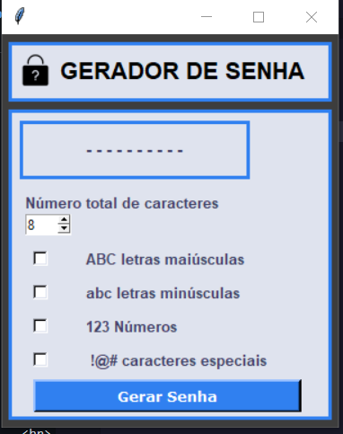
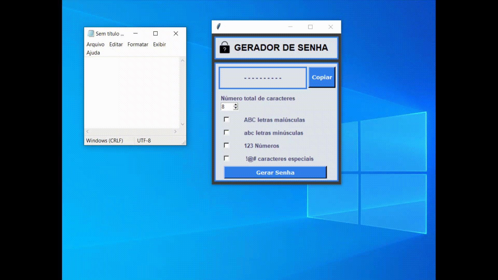

# GERADOR DE SENHA

## Função : 

* Programa desenvolvido em Python,
A fim de gerar senhas de 1 a 20 caracteres para serem utilizadas, a senha pode ser gerada a partir da escolha das opções de formação dos seus caracteres:
    * Letras Maiúsculas;
    * Letras Minúsculas;
    * Números;
    * Caracteres Especiais;
* Além de possibilitar a funcionalidade de copiar a senha gerada.

## Ferramentas e tecnologias usadas:
1.Python 
2.Visual Studio Code

 
 

 
 

